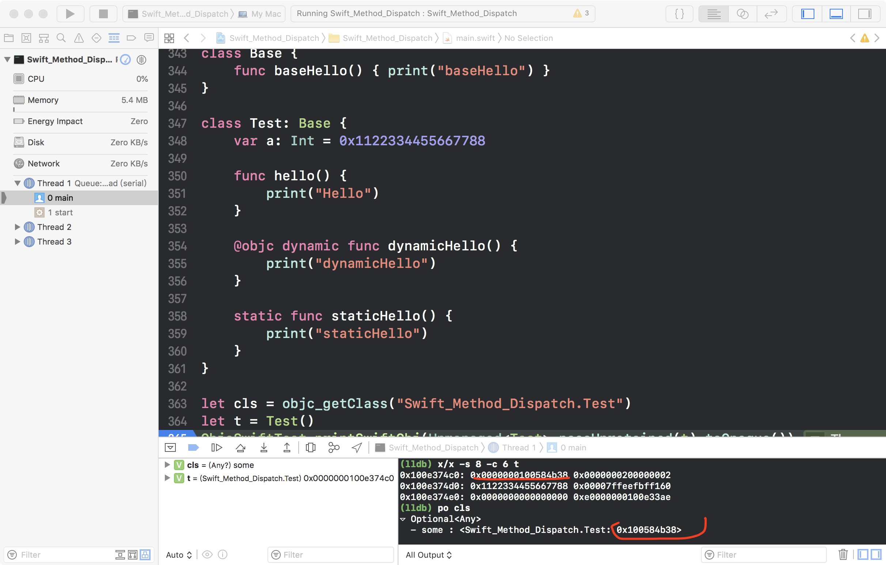
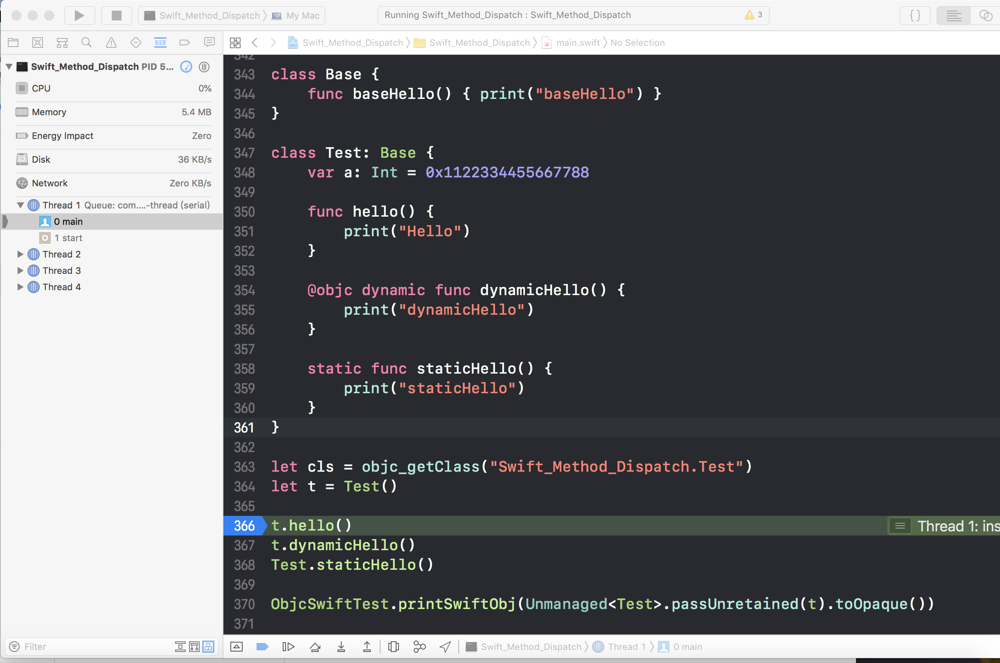
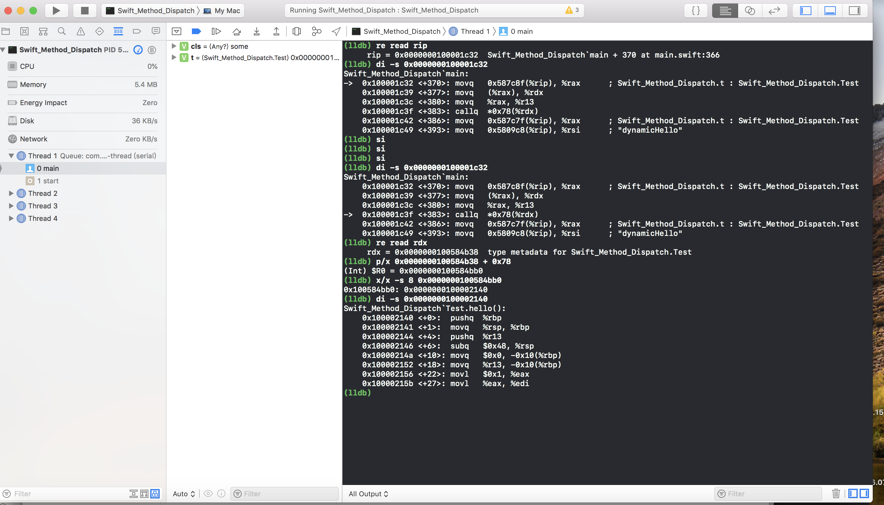
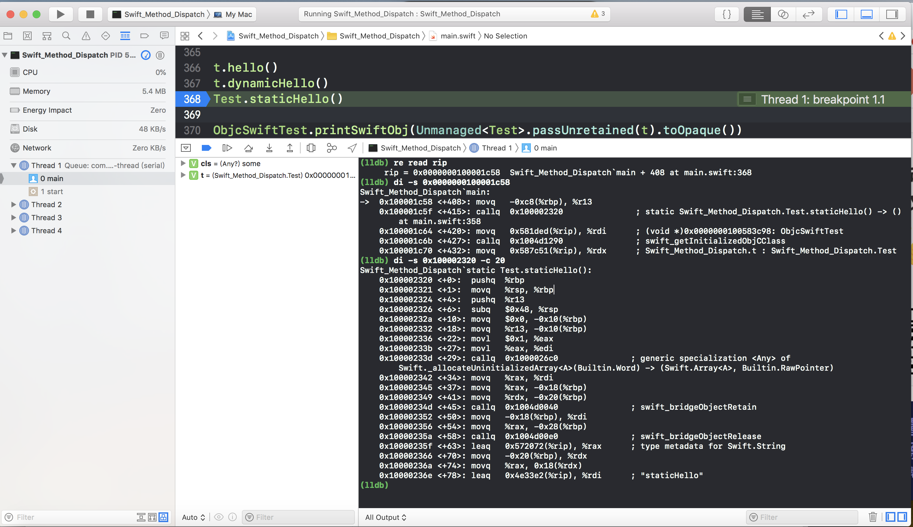
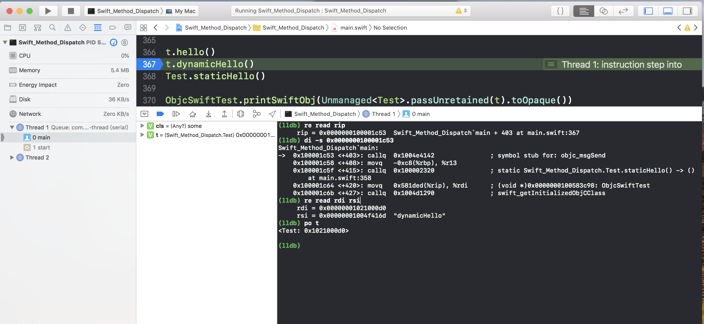
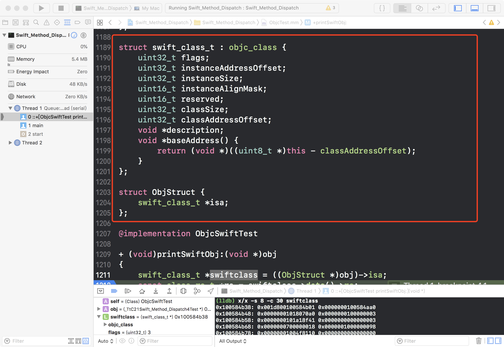
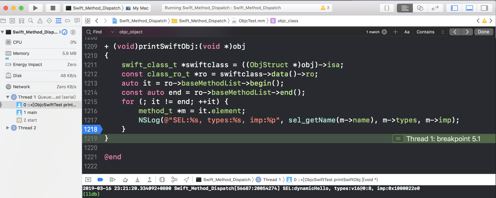

# Swift学习笔记

* [I.swift概要](#I.swift概要)
    * [可选型](#可选型)
        * [可选型解包](#可选型解包)
        * [空合运算符](#空合运算符)
        * [可选链](#可选链)
        * [隐式可选型](#隐式可选型)
    * [枚举](#枚举)
        * [嵌套枚举](#嵌套枚举)
        * [关联值](#关联值)
        * [方法和属性](#方法和属性)
        * [枚举&协议](#枚举&协议)
        * [枚举的扩展](#枚举的扩展)
        * [枚举&泛型](#枚举&泛型)
     * [结构体](#结构体)
        * [Struct的相对于Class的优缺点](#Struct的相对于Class的优缺点)
        * [Swift中类和结构体的共同点](#Swift中类和结构体的共同点)
        * [Swift中类和结构体的不同点](#Swift中类和结构体的不同点)
        * [mutating关键字](#mutating关键字)
    * [面向对象](#面向对象)
        * [属性](#属性)
        * [构造函数](#构造函数)
        * [构造函数继承规则](#构造函数继承规则)
        * [函数的重载与重写](#函数的重载与重写)
     * [访问控制](#访问控制)
        * [Modules和源文件](#Modules和源文件)
     * [运算符重载](#运算符重载)
        * [自定义运算符](#自定义运算符)
     * [下标](#下标)
        * [下标语法](#下标语法)
     * [泛型](#泛型)
        * [泛型函数](#泛型函数)
        * [泛型类型](#泛型类型)
        * [泛型类型约束](#泛型类型约束)
        * [关联类型](#关联类型)
        * [泛型约束where子句](#泛型约束where子句)
     * [swift协议](#swift协议)
        * [属性](#属性)
        * [方法](#方法)
        * [mutating关键字](#mutating关键字)
        * [协议组合](#协议组合)
* [II.Swift内存布局](#II.Swift内存布局)
    * [class](#clss)
* [III.Swift函数派发机制](#II.Swift函数派发机制)
    * [函数表派发(Table Dispatch)](#函数表派发\(Table Dispatch\))
    * [直接派发(Direct Dispatch)](#直接派发(Direct Dispatch))
    * [消息机制派发(Message Dispatch)](#消息机制派发(Message Dispatch))


# I.swift概要
## 可选型

可选型是Swift语言的特色之一，用于表达一个变量/常量可以为nil或者非nil值。可选类型其本质是一个枚举型，包含none和some两种类型。Optional.none就是nil, 非nil的原始值会通过some(T)包装，这也是为什么在使用Optional的时候要拆包的原因, 就是为了从enum里取出来原始值。可选型表示方法如下：
```
var num: Int? = 1
```
nil在Objective-C中表示一个空指针；nil在Swift中不是空指针，nil是个确定的值，用来表示值缺失
```
var view: UIView = nil //报错：Nil cannot initialize specified type 'UIView'
var view: UIView? = nil //正确
```
#### 可选型解包
```
// 解包方式1
var name: String? = "令狐冲"
if name != nil {
    print("姓名\(name!)") // 使用!强制解包
} else {
    print("name 为 nil")
}

```

```
// 使用可选绑定获取可选类型的值（官方推荐）
var name: String? = "令狐冲"
if let name = name {
    print("姓名\(name)") // 使用!强制解包
} else {
    print("name 为 nil")
}
```
#### 空合运算符
空合运算符（nil coalecse）“a ?? b” 将对可选类型a进行空判断，如果a非nild就对其进行解包，否则就返回一个默认值b
```
var name: String? = "鹿晗"
var address: String? = nil
print((name ?? "XXX"),"来自", (address ?? "未知地区"))
// print结果为：鹿晗 来自 未知地区
```
#### 可选链
可选链(optional chaining)为一种可以在当前值可能为nil的可选值上请求和调用属性、方法及下标的方法。如果可选值有值，那么调用就会成功；如果可选值是nil，那么调用将返回nil。多个调用可以连接在一起形成一个调用链，如果其中任何一个节点为nil，整个调用链都会失败，即返回nil。
```
let name = person.dog?.name?.lowercased()
```
#### 隐式可选型
变量或常量后加上!的都是隐式可选变量/常量。首先该变量或常量满足可选类型，其可被当成一般的变量/常量来使用，而不需要每次都验证是否有值。隐式可选型主要用在一个变量/常量在定义瞬间完成之后值一定会存在的情况，例如在类的初始化过程中等。
```

class Dog {
    weak var owner: Person?
    init(owner: Person) {
        self.owner = owner
    }
}

class Person {
    var dog: Dog!
    init() {
    
        /**
        * 这里我们希望dog在Person初始化之后即可立即使用所以在这里dog不应该设置为可选型。
        * 如果dog不是可选型 self.dog = Dog(owner: self)这行代码就会报错如下：
        * 'self' used before all stored properties are initialized
        * 原因是我们必须在Person所有的非可选型存储变量初始化之后才可以使用self变量，而这里
        * 我们的Dog初始化又需要一个Person类型参数，在这种情况下就可以将dog设置为隐式可选型
        */
        self.dog = Dog(owner: self) 
    }
}

```

## 枚举
与OC中枚举只能是int类型不同，Swift的枚举支持的数据类型有很多，例如整型(Integer)、浮点数(Float Point)、符串(String)等
```
enum Movement:Int {
    case left = 0
    case right = 1
    case top = 2
    case bottom = 3
}

enum Area: String {
    case SH = "shanghai"
    case GZ = "guangzhou"
    case SZ = "shenzhen"
}

enum Animal {
    case cat
    case dog
    case pig
}

```
#### 嵌套枚举
```
enum Area {
    enum ShenZhen {
        case NanShan
        case FuTian
    }

    enum GuangZhou {
        case TianHe
        case CheBei
    }
}

```
#### 关联值

```
// 声明枚举Trade
enum Trade {
    case buy(stock:String, amount:Int)
    case sell(stock:String, amount:Int)
}

// 使用枚举Tbrade

let trade = Trade.buy(stock: "00700", amount: 100)

switch trade {
    case .buy(let stock,let amount):
        print("\(trade) 股票:\(stock), 数量:\(amount)")
        
    case .sell(let stock,let amount):
        print("\(trade) 股票:\(stock), 数量:\(amount)")
}

// print输出： buy(stock: "00700", amount: 100) 股票:00700, 数量:100

```
#### 方法和属性
```
enum Device {
    case iPad, iPhone, AppleTV, AppleWatch
    
    func introduced() -> String {
        switch self {
            case .iPad: return "This is iPad"
            case .iPhone: return "This is iPhone"
            case .AppleWatch: return "This is AppleWatch"
            case .AppleTV: return "This is AppleTV"
        }
    }
}

print(Device.iPhone.introduced())

// print输出：This is iPhone
```

增加一个存储属性到枚举中不被允许，但你依然能够创建计算型属性。

```
enum Device {
    case iPad, iPhone
    var price: Double {
        switch self {
            case .iPhone: return 8000.0
            case .iPad: return 6000.0
        }
    }
}
```

#### 枚举&协议
Swift也允许你在枚举中使用协议(Protocols)和协议扩展(Protocol Extension)。

```
例：Swift标准库中有一个CustomStringConvertible是一个定义了格式化输出的Api的协议。

protocol CustomStringConvertible {
    var description: String { get }
}


enum Trade: CustomStringConvertible{
    case buy(stock:String, amount:Int)
    case sell(stock:String, amount:Int)

    var description: String {
        switch self {
            case .buy(let stock,let amount):
                return " 股票:\(stock), 数量:\(amount)"
            case .sell(let stock,let amount):
                return " 股票:\(stock), 数量:\(amount)"
        }
    }
}

print(Trade.buy(stock: "00700", amount: 100).description)

// print输出： 股票:00700, 数量:100

```
#### 枚举的扩展
枚举也可以进行扩展，我们可以将枚举的case和method分离使得代码的可读性更强。

```
enum Trade {
    case buy(stock:String, amount:Int)
    case sell(stock:String, amount:Int)
}

extension Trade: CustomStringConvertible {
    var description: String {
        switch self {
            case .buy(let stock,let amount):
                return " 股票:\(stock), 数量:\(amount)"
            case .sell(let stock,let amount):
                return " 股票:\(stock), 数量:\(amount)"
        }
    }
}

print(Trade.buy(stock: "00700", amount: 100).description)

// print输出： 股票:00700, 数量:100
```
#### 枚举&泛型
```
enum Theme<T: UIView> {
    case day(T)
    case night(T)

    func apply() {
        switch self {
            case .day(let view):
                view.backgroundColor = UIColor.white
            case .night(let view):
                view.backgroundColor = UIColor.black
        }
    }
}

let v = UIView(frame: CGRect(x: 0, y: 0, width: 100, height: 100))
Theme.night(v).apply()
```

## 结构体

struct是值类型而class是引用类型，值类型的变量直接包含他们的数据，而引用类型的变量存储对他们的数据引用，因此对一个引用类型变量操作可能影响另一个引用类型变量所引用的对象。对于值类型都有他们自己的数据副本，因此对一个值类型变量操作不可能影响另一个值类型变量。相对于OC中的Struct，Swift中的Struct变得更加强大,不仅有成员变量,还多了成员方法,这些特性使它更加接近于一个类.

#### Struct的相对于Class的优缺点
优点：

- 安全性
因为struct是用值类型传递的，每个struct变量各自持有一份单独的内存数据，不会出现被其他持有者改变的现象

- 内存
没有引用数，所以不会因为循环引用导致内存泄漏

- 速度
值类型的内存通常来说是以在栈上分配的，而不是用堆，因此他们比在堆上分配内存的引用类型要快

缺点：

- OC和Swift的混合开发
在混合开发中，Swift的struct不能够被OC调用，因为要在OC里调用Swift代码的话，被调用对象需要继承于NSObject

- 继承
作为面向对象的三大特征之一，继承让开发者高效得实现代码重用，但是struct不支持继承，不过好在struct支持协议,这也体现了Swift面向协议的编程思想


#### Swift中类和结构体的共同点

- 定义属性用于存储值
- 定义方法用于提供功能
- 定义下标脚本用于访问值
- 定义构造器用于生成初始化值
- 通过扩展以增加默认实现的功能
- 实现协议以提供某种标准功能

#### Swift中类和结构体的不同点

- 结构体不具有继承性
- 结构体没有析构器
- 结构体不使用引用计数（值类型）


#### mutating关键字

Swift中结构体和枚举可以定义自己的方法，但是默认情况下实例方法中是不可以修改自身属性值，当你需要修改自身属性值需要在函数前加mutating

```
struct Point {
    var x = 0, y = 0

    mutating func move() {
        x += 1
        y += 1
    }
}

```


## 面向对象

#### 属性
- 存储型属性

存储型属性就是存储特定类的一个常量或者变量。常量存储的属性使用let关键字定义，变量存储的属性使用var关键字定义

```
class Test {
    var propertyA: Int?
    let propertyB: Int = 10
}
```

- 懒存储属性

懒存储属性是指当被第一次调用的时候才会生成其初始值的属性，一个懒存储属性通过在属性声明的前面加上lazy来标示

```
class Person {
    lazy var propertyLazy: Test = Test()
}
```

- 计算型属性

计算型属性不存储值，它需要提供getter或setter来进行获取值或者赋值（赋值需要另外声明一个变量用于存储值）。getter使用get关键字进行定义，setter使用set关键字进行定义

```
class Person {
    var height: Double {
        get {
            return 180.0
        }
    }
}
```

- 属性观察器

属性观察器包括willSet和didSet，其中属性值改变前会触发willSet，属性改变后会触发didSet
(1)willSet有一个名为newValue的默认参数代表即将设置的新值
(2)didSet有一个名为oldValue的默认参数代表修改之前的旧值
(3)属性初始化时，willSet和didSet不会调用。只有在初始上下文之外，当设置属性值时才会调用。另外，在didSet的实现体内给属性赋值，也不会再次调用属性的属性观察器
(4)即使是设置的值和原来的值相同，willSet和didSet也会被调用

```
class Person {
    var age: Int {
        willSet {
            print("willSet, newValue =", newValue)
        }
        didSet {
            print("didSet, oldValue =", oldValue)
        }
    }

    init() {
        age = 10
    }
}

```
- 类型属性

类型属性与实例对象无关，不需要对类进行实例化就可以使用。
类型属性使用关键字static来定义，结构体、枚举和类都可以定义类型属性。在为类定义类型属性时，可以使用class关键字来代替static关键字。跟实例的存储属性不同，类型的存储属性必须指定默认值，因为类型本身无法在初始化过程中使用构造器给类型属性赋值

```
class Person {
    static var propertyA: Int = 10
    static var propertyB: Int {
        return 20
    }
    class var propertyC: String {
        return "TTTTTTT"
    }
}
```

#### 构造函数

构造函数是一种特殊的函数，主要用来在创建对象时做一些数据初始化工作。OC的初始化是沿着类继承关系链从父类开始逐级向子类初始化，而Swift的初始化是先从子类开始然后逐级向父类初始化，在调用父类构造函数之前,必须保证本类的属性已经完成初始化。Swift中非optional属性都必须在构造函数中设置初始值，从而保证对象在被实例化的时候属性都被正确地初始化


#### 构造函数继承规则

1.如果子类没有实现任何指定构造函数则会继承父类所有的指定构造函数和便利构造函数

2.如果子类实现了自己的指定构造函数但没有完全覆盖父类的指定构造函数则不会继承父类的任何便利构造函数和未覆盖的父类的指定构造函数

3.如果子类覆盖了父类所有的指定构造函数则自动继承父类所有的便利构造函数

```
class Person {
    var name: String
    var age: Int
    // 指定构造函数
    init(name: String, age: Int) {
        self.name = name
        self.age = age
    }
    // 指定构造函数
    init(other: Int) {
        self.name = ""
        self.age = 1
    }
    // 便利构造函数
    convenience init(flag: Int) {
        self.init(name: "", age: 0)
    }
}

class Teacher: Person {
    // 覆盖父类指定构造函数
    override init(name: String, age: Int) {
        super.init(name: name, age: age)
    }
    // 覆盖父类指定构造函数
    override init(other: Int) {
        super.init(other: other)
    }
    init(haha: String) {
        super.init(name: "haha", age: 30)
    }
}

let teacher = Teacher(flag: 10)
let teacher2 = Teacher(name: "gsd", age: 26)

```


#### 函数的重载与重写

- 重载: overload

- - 函数名相同，参数类型和个数不同
- - 如果重载了构造函数，并没有实现父类的init方法,系统不再提供init()构造函数

- 重写: override

- - 父类中已存在此方法
- - 子类重新实现父类的方法


## 访问控制

1.private

表示只能在当前类里访问(注:swift4.0中,extension里可以访问private属性)

2.fileprivate

表示在当前swift源文件里可以访问

3.internal(默认访问级别，可不写)

- internal访问级别所修饰的属性或者方法在所在的整个模块都可以访问

- 如果是框架或者代码库，则在整个框架内部都可以访问，框架由外部引用时则不可以访问

- 如果是app代码，在整个app都可以访问

4.public

表示可以被任何人访问，但在其他module中不可以被override和继承，而在module内可以被override和继承

5.open

表示可以被任何人使用，包括override和继承

#### Modules和源文件

Swift 的访问控制模型是基于 module 和 源文件的。在 Swift 文档中对 module 和源文件的解释如下：

一个 module 是一个独立的代码建造单元，例如一个 framework 或者 application 可以构建和包装成一个可以被其他 module 通过 Swift 的关键字 import 的单元。

在 Xcode 中的每个编译 target （例如一个 app bundle 或者 framework）都被视作 Swift 里的一个单独的 module。如果将应用程序代码的各个部分组合成一个独立的框架，也许可以在多个应用程序中封装和重用这些代码，那么当它被导入并在程序中使用时，或者在另一个 framework 中使用时，在该框架中定义的所有内容都将是独立 module 的一部分。

一个源文件是在一个 module 里单独的 Swift 源码（或在 一个 app 或 framework 里的单独的文件） 。虽然常见的是在分开的源文件里定义单独的类型，但一个单独的源文件也能包含多个类型，方法等的定义。


## 运算符重载


在Swift的官方文档中运算符重载叫做运算符函数（Operator Functions），顾名思义就是对已经有的运算符覆盖定义自己的函数实现。三元运算符(a？b：c)和默认的赋值运算符符(=)是不可重载的。话不多说，请直接看Demo：

```
struct Test {
    var x: Int
    var y: Int
    var z: Int
}

func + (left: Test, right: Test) -> Test {
    return Test(x: left.x + right.x, y: left.y + right.y, z: left.z + right.z)
}

func - (left: Test, right: Test) -> Test {
    return Test(x: left.x - right.x, y: left.y - right.y, z: left.z - right.z)
}

func * (left: Test, right: Test) -> Test {
    return Test(x: left.x * right.x, y: left.y * right.y, z: left.z * right.z)
}

func / (left: Test, right: Test) -> Test {
    return Test(x: left.x / right.x, y: left.y / right.y, z: left.z / right.z)
}

func == (left: Test, right: Test) -> Bool {
    return left.x == right.x && left.y == right.y && left.z == right.z
}

func > (left: Test, right: Test) -> Bool {
    return left.x > right.x || left.y > right.y || left.z == right.z
}

func >= (left: Test, right: Test) -> Bool {
    return left == right || left > right
}

func < (left: Test, right: Test) -> Bool {
    return !(left >= right)
}

func += (left: inout Test, right: Test) {
    left = left + right
}

func -= (left: inout Test, right: Test) {
    left = left - right
}

prefix func - (left: Test) -> Test {
    return Test(x: -left.x, y: -left.y, z: -left.z)
}


let t1 = Test(x: 2, y: 4, z: 6)
let t2 = Test(x: 1, y: 2, z: 3)

print("t1 + t2 = ", t1 + t2)
print("t1 - t2 = ", t1 - t2)
print("t1 * t2 = ", t1 * t2)
print("t1 / t2 = ", t1 / t2)
print("t1 > t2 = ", t1 > t2)
print("t1 == t2 = ", t1 == t2)
print("t1 >= t2 = ", t1 >= t2)
print("t1 < t2 = ", t1 < t2)

var tmpT1 = t1
let tmpT2 = t2
tmpT1 += tmpT2
print("tmpT1 += tmpT2, tmpT1 = ", tmpT1)

var tmpT3 = t1
let tmpT4 = t2
tmpT3 -= tmpT4
print("tmpT3 -= tmpT4, tmpT3 = ", tmpT3)

print("- t1 = ", -t1)

/** 打印结果为

t1 + t2 =  Test(x: 3, y: 6, z: 9)
t1 - t2 =  Test(x: 1, y: 2, z: 3)
t1 * t2 =  Test(x: 2, y: 8, z: 18)
t1 / t2 =  Test(x: 2, y: 2, z: 2)
t1 > t2 =  true
t1 == t2 =  false
t1 >= t2 =  true
t1 < t2 =  false
tmpT1 += tmpT2, tmpT1 =  Test(x: 3, y: 6, z: 9)
tmpT3 -= tmpT4, tmpT3 =  Test(x: 1, y: 2, z: 3)
- t1 =  Test(x: -2, y: -4, z: -6)
*/

```

#### 自定义运算符

除了重载标准的运算符我们还可以声明一些个性的运算符，但个性的运算符只能使用这些字符 / = - + * % < > ! & | ^ . ~
新的运算符声明需在全局域使用operator关键字声明，可以声明为前缀，中缀或后缀的，分别用prefix、infix和postfix修饰

```
// 使用operator关键字声明 +++++
postfix operator +++++

postfix func +++++ (left: inout Test) {
    left.x += 5
    left.y += 5
    left.z += 5
}

var t3 = Test(x: 2, y: 4, z: 8)

t3+++++
print("t3+++++ =", t3)

/** 打印结果为

t3+++++ = Test(x: 7, y: 9, z: 13)

*/

```

## 下标

下标可以定义在类、结构体和枚举中，是访问元素的快捷方式，可以使用下标的索引设置和获取值。例如用下标访问一个 Array实例中的元素可以写作arr[index]，访问Dictionary实例中的元素可以写作dict[key]。一个类型可以定义多个下标，通过不同索引类型进行重载。下标不限于一维，你可以定义具有多个入参的下标满足自定义类型的需求。

#### 下标语法

定义下标使用 subscript 关键字，指定一个或多个输入参数和一个返回类型；与实例方法不同的是，下标可以设定为读写或只读。这种行为通过设置 getter 和 setter 实现，有点类似计算型属性：

```
class Person {
    var childA: String? = "大宝"
    var childB: String? = "二宝"
    var childC: String? = "三宝"
    var childD: String? = "四宝"

    subscript(index: Int) -> String? {
        get {
            switch index {
                case 0:
                    return childA
                case 1:
                    return childB
                case 2:
                    return childC
                case 3:
                    return childD
                default :
                    return nil
            }
        }
        set {
            switch index {
                case 0:
                    childA = newValue
                case 1:
                    childB = newValue
                case 2:
                    childC = newValue
                case 3:
                    childD = newValue
                default :
                    break
                }
            }
        }
}

let p = Person()

print(p[0], p[1], p[2], p[3])

/** 打印结果为

Optional("大宝") Optional("二宝") Optional("三宝") Optional("四宝")

*/

p[1] = "二二二二"
p[2] = "三仨叁③"

print(p[0], p[1], p[2], p[3])

/** 打印结果为

Optional("大宝") Optional("二二二二") Optional("三仨叁③") Optional("四宝")

*/

```

## 泛型

#### 泛型函数

```
func swapTwoValues<T>(a: inout T, b: inout T) {
    let tempValue = a
    a = b
    b = tempValue
}

var a = 10
var aa = 20
swapTwoValues(a: &a, b: &aa)
print(a, aa) // 打印结果：20 10

var b = "b"
var bb = "bb"
swapTwoValues(a: &b, b: &bb)
print(b, bb) // 打印结果：bb b

```

#### 泛型类型

```
struct Stack<Element>{
    var items = [Element]()
    mutating func push(item:Element){
        items.append(item)
    }
    mutating func pop()->Element{
        return items.removeLast()
    }
}

```

#### 泛型类型约束
在下面的这个函数中，有两个类型约束，第一次类型参数C代表属于某个类，第二个参数P代表遵守某个协议。

```
func somFuntion<C: UIView, P: Hashable>(someClass: C, someProtocol: P) {

}

```
```
func containsValue<S:Equatable>(array: [S], valueToFind: S) -> Bool {
    for value in array {
        if value == valueToFind {
            return true
        }
    }
    return false
}

```

#### 关联类型

在定义协议的时候，可以用一个或者多个关联类型作为定义协议的一部分，为某个类型提供了一个占位符，其实际类型会在实现协议的时候被指定，并用关键字typealias关键字来指定具体的关联类型

```
protocol Container {
    associatedtype itemType
    mutating func append(item: itemType)
    var count: Int { get }
    subscript(i: Int) -> itemType { get }
}

struct genericStack<Element>: Container {
    var items = [Element]()
    mutating func push(item: Element) {
    items.append(item)
    }
    mutating func pop() -> Element {
        return items.removeLast()
    }

    // Container 协议的实现部分
    typealias ItemType = Element
    mutating func append(item: ItemType) {
        self.push(item: item)
    }
    var count: Int {
        return items.count
    }
    subscript(i: Int) -> ItemType {
        return items[i]
    }
}

```

#### 泛型约束where子句

类型约束能够让我们为泛型类型添加一些约束和条件，可以使用where子句来为关联类型添加约束

```
func allItemsMatch<C1: Container, C2: Container>(left: C1, right: C2) -> Bool 
where C1.itemType == C2.itemType, C1.itemType: Equatable {
    if left.count != right.count{
        return false
    }
    for i in 0..<left.count {
        if left[i] != right[i] {
            return false
        }
    }
    return true
}

```


## swift协议

#### 属性

协议可以要求遵循协议的类型提供特定名称和类型的实例属性或类型属性。协议不指定属性是存储属性还是计算属性，它只指定属性的名称和类型和读写控制。协议总是用var关键字来声明变量属性，在类型声明后加上{ set get }来表示属性是可读可写的，可读属性则用{ get }来表示。

```
protocol SomeProtocol {
    var a: Int { get set }
    var b: Int { get }
}

```

另外在协议中还可以定义类型属性时，并使用static关键字修饰

```
protocol SomeProtocol {
    static var a: Int { get set }
    static var b: Int { get }
}

```

#### 方法

协议可以要求遵循协议的类型实现某些指定的实例方法或类方法。在协议中声明这些方法时不需要大括号和方法体，可以在协议中定义具有可变参数的方法，和普通方法的定义方式相同。但是，不支持为协议中的方法的参数提供默认值。

```
protocol RandomNumberGenerator {
    func random() -> Double
}

```

#### mutating关键字

在值类型(即结构体和枚举)的实例方法中，如果将mutating关键字作为方法的前缀写在 func关键字之前，表示可以在该方法中修改它所属的实例以及实例的任意属性的值。如果你在协议中定义了一个实例方法，该方法会改变遵守该协议的类型的实例，那么在定义协议时需要在方法前加mutating关键字，这使得结构体和枚举能够遵循此协议并满足此方法要求。

```


```

#### 协议组合

Protocol Composition，中文叫“协议组合”或“协议合成”，简单地来说就是把不同的协议组合起来以使目标对象限定在满足全部协议的一种方式。

下面的例子中声明了一个叫Named的协议，提供 name （名字）这个属性，还有一个叫Aged的协议，提供 age（年龄）这个属性，然后可以用 & 这个操作符，以 Named & Aged 的形式将这两个协议组合起来就可以使传入的参数即满足 Named 又满足 Aged 了。

```
protocol Named {
var name: String { get }
}

protocol Aged {
var age: Int { get }
}

struct Person: Named, Aged {
var name: String
var age: Int
}

func wishHappyBirthday(to celebrator: Named & Aged) {
print("Happy birthday, \(celebrator.name), you're \(celebrator.age)!")
}

let birthdayPerson = Person(name: "Malcolm", age: 21)
wishHappyBirthday(to: birthdayPerson) // 打印结果：Happy birthday, Malcolm, you're 21!

```

# II.Swift内存布局
## class

Swift中的实例对象和Objective-C中的实例对象对应的objc_object结构体类似，第一个成员是isa指针指向Swift的类对象，我们以Test的实例对象t为例验证一下：



上例中的t是Test类的示例对象，那么Test类的metadata内存布局又是怎样的呢？这里我添加了一个oc++的文件，文件内部模拟了一个swift_class_t结构体，我们传递一个Test对象t给printSwiftObj函数，在这个函数内部获取t的类metadata并分析其内存布局。


# II.Swift函数派发机制

```
protocol Speakable {
    func speak();
}

extension Speakable {
    func speak() {
        print("SpeakAble ah ah ah")
    }
    func laugh() {
        print("SpeakAble ge ge ge ...")
    }
}

class Person: Speakable {
    func speak() {
        print("Person hello")
    }
    func laugh() {
        print("Person ha ha ha...")
    }
}

let person = Person()
let speaker: Speakable = person

person.laugh() // Person ha ha ha...
speaker.laugh() // SpeakAble ge ge ge ...

```


函数派发就是处理如何去调用一个函数的问题。了解函数派发机制有助于你写出高性能的代码，同时也能够解释很多swift里的奇怪的行为。
编译型语言有三种常见的函数派发方式：直接派发(Direct Dispatch)、 函数表派发(Table Dispatch) 和 消息派发(Message Dispatch)。C++ 默认使用直接派发，但可以通过加上 virtual修饰符来改成函数表派发。而OC则总是使用消息机制派发，一些开发者也会通过在OC中混编入C以利用C语言的直接函数派发来实现提升性能的目标。

下面请看demo：



## 函数表派发(Table Dispatch)
函数表派发是编译型语言实现动态行为最常见的实现方式。函数表使用了一个数组来存储类声明的每一个函数的指针。大部分语言把这个称为“virtual table”(虚函数表)， Swift 里称为 “witness table”。每一个类都会维护一个函数表，里面记录着类所有需要通过函数表派发的函数，如果在本类中override了父类函数被的话表里面只会保存被override 之后的函数。一个子类在声明体内新添加的函数都会被插入到这个函数表的后面，运行时会根据这一个表去决定实际要被调用的函数。
demo中创建了一个父类Base和一个继承自Base的Test类，其中Test类的metadata内存布局图如下：


通过反汇编观察函数表派发的大致实现方式如下：



当一个函数被调用时, 会经历下面的几个过程:
读取对象的函数表
从函数表中取出目标函数地址
跳转到目标函数地址执行
查表是一种简单、易实现、而且性能可预知的方式， 然而这种派发方式比起直接派发的性能还是差了一点。另外这种函数表派发的缺陷在于函数表无法拓展，子类会在虚数函数表的后面插入新的函数，没有位置可以让extension安全地插入函数。

从这个表中可以发现Test的metadata函数表没有包含dynamicHello和staticHello这两个方法，那是因为dynamicHello方法通过消息机制派发，staticHello方法通过静态调用方式直接派发。

## 直接派发(Direct Dispatch)
直接派发是最快的， 不止是因为需要调用的指令集会更少，并且编译器还能够有很大的优化空间，例如函数内联等。然而静态调用对于编程来说也就意味着因为缺乏动态性所以没办法支持继承。



## 消息机制派发(Message Dispatch)
消息机制是调用函数最动态的方式，这样的机制催生了KVO，UIAppearence和CoreData等功能。这种运作方式的关键在于开发者可以在运行时改变函数的行为，不止可以通过swizzling来改变，甚至可以用isa-swizzling修改对象的继承关系，可以在面向对象的基础上实现自定义派发。
OC中的消息机制我们已经很熟悉了，下面我们重点看下swift中如何在加入了函数表派发和直接派发机制之后又兼容了消息派发机制的。

再看一眼Test的metadata内存布局图：


从图中我们可以看到，其实swift_class_t是继承自objc_class的，这就意味着swift从一出生开始就继承了OC爸爸的强大动态性的基因，所以在swift中实现各种动态功能也自然不在话下，只是看swift愿不愿意这样做的问题。

在demo中我们给Test类添加了一个动态函数@objc dynamic func dynamicHello()，然后我们在上面的函数表中也确实没有看到dynamicHello的影子，那么它到底是如何被Test类管理的呢，请看以下实验代码：




在控制台输出的反汇编代码中，我们看到了熟悉的messagesend函数，这也就证明了dynamicHello确实是通过消息机制派发的，那么到底dynamicHello函数被保存在了什么位置呢，我们继续往下看：

这里我添加了一个oc++的文件，文件内部模拟了一个swift_class_t结构体，我们传递一个swift对象给printSwiftObj函数，在这个函数内部获取swift对象的类metadata并从中找出方法动态方法列表，然后从这个动态列表中查询dynamicHello的踪迹。








